# Procedural Particle Graphics

## About

Parametric shapes rendered as particle effects inside Minecraft. This project explores classic computer graphics concepts, including curves, geometry, transformations, and animation, using Minecraft's particle system as the "canvas."

Circles, spheres, toruses, stars, cylinders, and more are generated procedurally from mathematical equations, then spawned as particles with animation and color variation.

Instead of hardcoding coordinates for each shape, every shape here is defined **parametrically**: a mathematical curve or surface equation is sampled at many points, and each point is spawned as a Minecraft particle. Because the shapes come from formulas rather than static point lists, they can be:

- Scaled, rotated, and translated
- Animated over time (rotation, pulsing, color shifts)
- Recolored using particle color/size options
- Combined into more complex composite shapes

Shapes included: circle, sphere, torus, star (astroid-based), cylinder, and more. See `src/data/graphics/modules/main.bolt`.

## Demo

> ⚠️ **Note:** Some of the demos below (flashing/pulsating effects) contain rapid flashing lights. Viewer discretion advised for those sensitive to strobing or flashing visuals.

| | | |
|---|---|---|
| 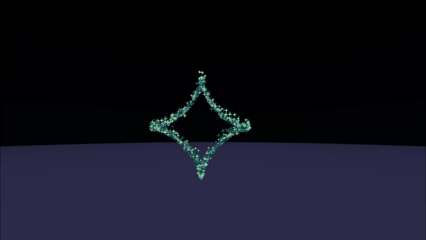<br>Star | 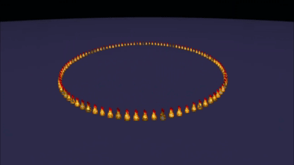<br>Circle | 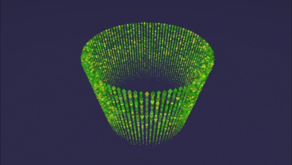<br>Falling Circle |
| 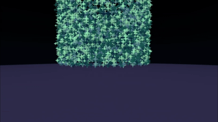<br>Cylinder | 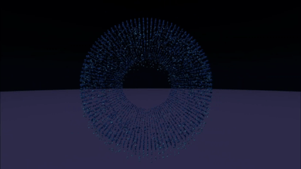<br>Torus | 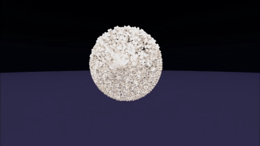<br>Disco Sphere |
| 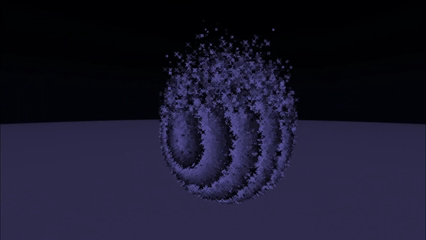<br>Striped Sphere | 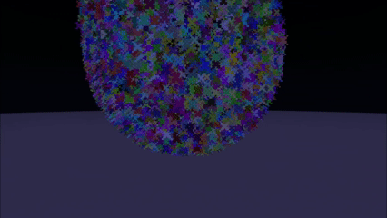<br>Colorful Sphere | 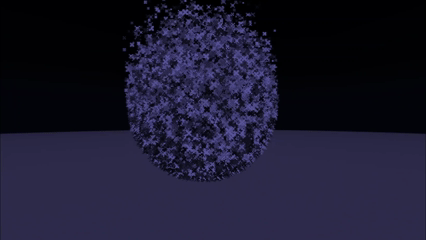<br>Flashing Sphere |
| 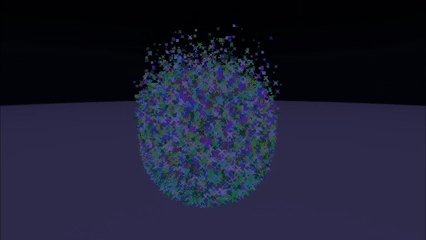<br>Colorful Flashing Sphere | 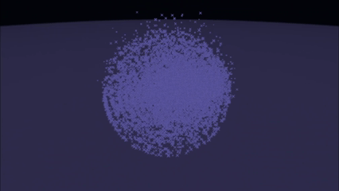<br>Pulsating Sphere | 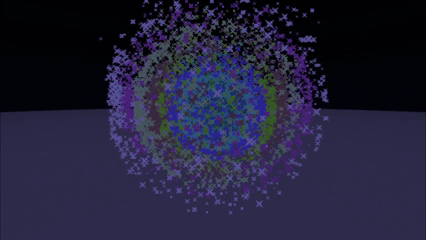<br>Colorful Pulsating Sphere |

## How It Works

The project is built with **[Beet](https://github.com/mcbeet/beet)** and **[Bolt](https://github.com/mcbeet/bolt)**:

- **Beet** is a Minecraft data pack build tool that handles project structure, file generation, and deploying the pack straight into a Minecraft world.
- **Bolt** is a scripting language that layers Python on top of Minecraft's own command language, so shape math and particle logic can be written in Python and compiled down into `.mcfunction` files.

Each shape module computes a set of 3D points from its parametric equation (e.g. spherical coordinates for a sphere, a major/minor radius sweep for a torus) and emits `particle` commands for each point, using `execute` to position and orient them relative to the player or a fixed origin.

## Requirements

Before using this project, make sure you have:

* Minecraft Java Edition
* Python
* Beet
* Bolt

You can check whether Beet is installed by running:

```
beet --version
```

## Build Instructions

Open a terminal in the project folder:

```
cd path\to\procedural-particle-graphics
```

Build the datapack:

```
beet build
```

This generates the Minecraft datapack files.

## Link To A Minecraft World

To link the generated datapack directly to a Minecraft world, run:

```
beet link "Your World Name"
beet build
```

Replace `"Your World Name"` with the name of your Minecraft world folder.
After building, open Minecraft and run:

```
/reload
```

## Running Effects In Minecraft

To run an effect from chat, include the slash:

```
/function effects:sphere
```

To run an effect inside a command block, leave off the slash:

```
function effects:sphere
```

### Available Effects

```
function effects:circle
function effects:falling_circle
function effects:star
function effects:cylinder
function effects:torus
function effects:disco_sphere
function effects:striped_sphere
function effects:colorful_sphere
function effects:flashing_sphere
function effects:colorful_flashing_sphere
function effects:pulsating_sphere
function effects:colorful_pulsating_sphere
```

## Recommended Command Block Settings

For animated effects, use these command block settings:

```
Repeat
Unconditional
Always Active
```

For one-time burst effects, use these command block settings:

```
Impulse
Unconditional
Needs Redstone
```

## Project Structure

```
procedural-particle-graphics/
├── particle-demo-gifs/       # Recorded demos of each shape in-game
│   ├── circle.gif
│   ├── colorful_flashing_sphere.gif
│   ├── colorful_pulsating_sphere.gif
│   ├── colorful_sphere.gif
│   ├── cylinder.gif
│   ├── disco_sphere.gif
│   ├── falling_circle.gif
│   ├── flashing_sphere.gif
│   ├── pulsating_sphere.gif
│   ├── star.gif
│   ├── striped_sphere.gif
│   └── torus.gif
├── src/
│   └── data/
│       └── graphics/
│           └── modules/     # Bolt/Python modules defining each parametric shape
│               └── main.bolt    # Entry point that ties the shape modules together
├── beet.json                # Beet project configuration
└── README.md
```

## Concepts Explored

- Parametric curves and surfaces
- 3D coordinate transformations (rotation, translation, scaling)
- Sampling and discretization of continuous geometry into discrete particles
- Animation via time-based parameter updates
- Color variation using particle options

## Acknowledgments

This project was built together with [Liam Wen](https://github.com/liamwen0714), based on shared work developed side by side. See his version at [minecraft-particle-system](https://github.com/liamwen0714/minecraft-particle-system).

## Sources & References

- [Minecraft Particle Commands Wiki](https://minecraft.wiki/w/Commands/particle)
- [Minecraft Particles Wiki](https://minecraft.wiki/w/Particles)
- [Minecraft Execute Command Wiki](https://minecraft.wiki/w/Commands/execute)
- [Sphere (Wikipedia)](https://en.wikipedia.org/wiki/Sphere)
- [Torus (Wikipedia)](https://en.wikipedia.org/wiki/Torus)
- [Cylinder (Wikipedia)](https://en.wikipedia.org/wiki/Cylinder)
- [Astroid (Wikipedia)](https://en.wikipedia.org/wiki/Astroid)
- [underleaf.ai/3d](https://www.underleaf.ai/3d)
- Reference videos:
  - https://www.youtube.com/watch?v=4m5azJ1yctc
  - https://www.youtube.com/watch?v=KzvSsl5ZSAI
  - https://www.youtube.com/watch?v=61A-qfls9BE
  - https://www.youtube.com/watch?v=IOS-OnqE4GY